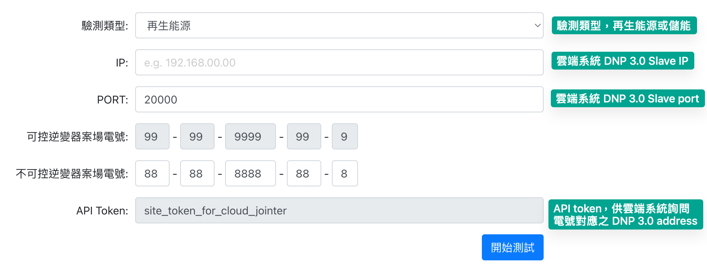

# DREAMS雲端對接測試程式

本測試程式旨在驗證雲端太陽能監控業者是否符合台電 DREAMS 規範，使其針對所管理電站能夠：
1. 將發電資料透過 DNP 3.0 傳回台電 DREAMS 系統
2. 透過 DNP 3.0 接受台電 DREAMS 系統控制指令，調控變流器之實功 / 虛功 / 功率因數上限或是 VPset 設定

詳細對接細節謹以台電官方公告為準。
如對測試程式本身實作細節有疑問，請於 [Issues](https://github.com/thingnario/dreams-cloud-joint-tester/issues) 提問，感謝。

## 系統需求
1. Linux 機器 (建議為 Ubuntu 18.04，有確實驗證過可以 work)
2. 需安裝 docker 以及 docker-compose
```
sudo apt update
sudo apt install docker.io
sudo apt install docker-compose
```
如果遇到安裝 docker 時 ubuntu 的台灣伺服器連不上，可以參考[這篇](https://dexter7311.pixnet.net/blog/post/27261462)

## 安裝方式
0. 安裝過程中請確保網路暢通
1. Git clone 或下載原始碼到欲安裝的機器，如果是用 git clone 請確保 submodule 都有下載完整
```
git clone https://github.com/thingnario/dreams-cloud-joint-tester.git
cd dreams-cloud-joint-tester
git submodule update --init --recursive
```
2. 在原始碼的根目錄下有 .env 資料夾，請將裡面的 `*.env.sample` 都複製一份，並改名為 `*.env` (去掉 `.sample`)。然後請將裡面內容作適度更改，特別是密碼的部分。
```
MYSQL_ROOT_PASSWORD=top_secret                          # MySQL root 密碼
MYSQL_DATABASE=dreams_business                          # 無須更改
MYSQL_ADDRESS=mysql                                     # 無須更改，"mysql"是docker之間的alias
ADMIN_ACCESS_TOKEN=top_secret_token                     # API server的API token(Admin，供測試程式本身使用)
JOINTER_ACCESS_TOKEN=site_token_for_cloud_jointer       # API server的API token(雲端對接系統專用)
API_HOST=localhost                                      # API server的host name/IP address，非本機使用時請更改
API_PORT=3000                                           # API server的port，有特別做port forwarding才需更改
```
3. 執行**根目錄**下的 deploy.sh，過程可能會花 30min 以上，請耐心等候
```
chmod 755 deploy.sh
sudo ./deploy.sh
```
4. 確認 deploy.sh 正常執行完畢之後請執行 docker ps(必要時請加 sudo，以 root 權限執行)，確認 container 都有跑起來
```
sudo docker ps
```
```
CONTAINER ID   IMAGE                               COMMAND                  CREATED              STATUS              NAMES
1b85aebeb5d7   dreamscloudjointtester_mq-dreams    "/entrypoint.sh pyth??   About a minute ago   Up 47 seconds       dreamscloudjointtester_mq-dreams_1
dfbb0818bb41   dreamscloudjointtester_dnp3-master  "/entrypoint.sh /dre??   About a minute ago   Up 33 seconds       dreamscloudjointtester_dnp3-master_1
7a9945482f8a   dreamscloudjointtester_master       "docker-entrypoint.s??   About a minute ago   Up About a minute   dreamscloudjointtester_master_1
f8ea868874dd   dreamscloudjointtester_mq           "docker-entrypoint.s??   About a minute ago   Up About a minute   dreamscloudjointtester_mq_1
dfcd177e08a3   dreamscloudjointtester_nginx        "nginx -g 'daemon of??   About a minute ago   Up 47 seconds       dreamscloudjointtester_nginx_1
b279e48d0a0e   mysql:5.7.29                        "docker-entrypoint.s??   About a minute ago   Up About a minute   dreamscloudjointtester_mysql_1
421bddc6ef5e   dreams-cloud-joint-tester-fake-modbus-server   "python -m fake_slave"   About a minute ago   Up About a minute   0.0.0.0:502->502/tcp, :::502->502/tcp   fake-modbus-server
```

## 操作說明
1. 若所安裝之作業系統為視窗版，安裝完畢之後在本機開啟瀏覽器。則網址輸入 https://localhost 應可看到如下畫面:

2. 請選擇驗測類型，並輸入待測雲端系統之 IP 位址等必要資訊。同時 API Token 也請代入雲端系統，方能取得電號與 DNP 3.0 address 的對照表。
3. 一切就緒後按下「開始測試」，會進入以下畫面。

4. 測項大致分成自動 / 手動判斷兩種進行方式，大部分可以跳著進行，唯獨 5-1 / 5-2 與 6-1 / 6-2 不建議分開進行。


## 本地環境儲能模擬 EMS 介接

使用 fake-modbus-server Docker 容器

可以通過以下步驟來設置並驗證 fake-modbus-server Docker 容器的連線

1. 確認 fake-modbus-server container 有在執行
```
sudo docker ps
```
```
CONTAINER ID   IMAGE                                          COMMAND                  CREATED              STATUS              PORTS                                   NAMES
421bddc6ef5e   dreams-cloud-joint-tester-fake-modbus-server   "python -m fake_slave"   About a minute ago   Up About a minute   0.0.0.0:502->502/tcp, :::502->502/tcp   fake-modbus-server
```

2. EMS 模擬器 Modbus Register 欄位地址說明

**以下是這個 Modbus 模擬器的參數說明**

- Modbus ID: **7**
- Host: **localhost**
- Port: **502**
- 開始讀取的地址: **21** (不同的 Modbus 工具其開始讀取地址的計算方式可能不同，21 or 22，詳情請看**特別注意事項**)
- 讀取長度: **27**
- 寄存器操作類型: **Holding Register**

**Register 欄位地址說明**

| Address | Type    | Description | R/W | Data Type | Unit   | Note |
|---------|---------|-------------|-----|-----------|--------|------|
| 21      | holding | Line Current PhaseA A相線電流 | R   | int32    | 0.1A   | 電表數值 |
| 23      | holding | Line Current PhaseB B相線電流 | R   | int32    | 0.1A   | 電表數值 |
| 25      | holding | Line Current PhaseC C相線電流 | R   | int32    | 0.1A   | 電表數值 |
| 27      | holding | Line Current PhaseN N相線電流 | R   | int32    | 0.1A   | 電表數值 |
| 29      | holding | Line Voltage Phase AB AB線電壓  | R   | uint32   | 0.01V  | 電表數值 併聯點電壓 (kV) 因電壓在高壓側 建議單位改為1V |
| 31      | holding | Line Voltage Phase BC BC線電壓 | R   | uint32   | 0.01V  | 電表數值 因電壓在高壓側 建議單位改為1V |
| 33      | holding | Line Voltage Phase AC AC線電壓  | R   | uint32   | 0.01V  | 電表數值 因電壓在高壓側 建議單位改為1V |
| 35      | holding | 實功 | R   | int32    | kW     | 電表數值 放電時為正值 |
| 37      | holding | 虛功 | R   | int32    | kVar   | 電表數值 |
| 39      | holding | 功率因數 | R   | int16    | %      | 並聯點 |
| 40      | holding | 頻率 | R   | uint16   | 0.1Hz  | 電表數值 |
| 41      | holding | 累積放電量 | R   | uint32   | kWh    | 電表數值 |
| 43      | holding | 累積充電量 | R   | uint32   | kWh    | 電表數值 |
| 45      | holding | 儲能系統狀態 | R   | uint16   |        | 0: stand by 1: charging 2. discharging 3. error |
| 46      | holding | 儲能系統電量(SOC) | R   | uint16   | kWh    | 儲能系統數值 |
| 47      | holding | 儲能系統循環使用次數(battery cycle count） | R   | uint16   |        | 儲能系統數值 |
| 48      | holding | 時間戳 | R   | uint32   | unix time |       |

<<<<<<< HEAD
**特別注意事項**

如果你使用不同的 Modbus 工具，其**開始讀取的地址**的計算方式可能會有所不同:

- Pymodbus 和 RMMS: 使用零偏移地址，address = 21。
- ModScan: 使用一偏移地址，address = 22。

這些是連接和讀取數據時必須設定的關鍵參數，確保在使用時正確配置以避免錯誤。

3. 可以使用本地端的腳本工具驗證連線

可以使用 `modbus_tcp_reader.py` 腳本來驗證連線並獲取所需的數據。此腳本使用 Pymodbus 為零偏移地址，address = 21
=======
3. 驗證連線
可以使用 `modbus_tcp_reader.py` 腳本來驗證連線並獲取所需的數據。
>>>>>>> master-github

需要安裝相關 Python 模組
```sh
pip install pymodbus
```

腳本說明
```sh
usage: modbus_tcp_reader.py [-h] [-H HOST] [-P PORT] -U UNIT -T {di,co,ir,hr} -A ADDRESS -C COUNT

options:
  -h, --help            show this help message and exit
  -H HOST, --host HOST  the host address (default: localhost).
  -P PORT, --port PORT  the port number (default: 502)
  -U UNIT, --unit UNIT  the unit identifier (range: 1..255)
  -T {di,co,ir,hr}, --table {di,co,ir,hr}
                        the primary table (choices: di,co,ir,hr)
  -A ADDRESS, --address ADDRESS
                        the address to be read (range: 0..65535)
  -C COUNT, --count COUNT
                        the count to be read (range: 1..2000 [di,co] or 1..125 [ir,hr]
```

此 EMS 模擬器的參數如下：

- -H: MODBUS Server 位置，預設為 **localhost**
- -P: MODBUS Server 的 Port，預設為 **502**
- -A: 開始讀取的地址為 **21**
- -C: 讀取長度為 **27**
- -T: 寄存器操作為 holding，在 MODBUS TCP 腳本中我們使用 **hr** 作為數入參數
- -U: MODBUS ID 為 **7**

執行腳本範例
```sh
python3 modbus_tcp_reader.py -A 21 -C 27 -T hr -U 7

Namespace(host='localhost', port=502, unit=7, table='hr', address=21, count=27)
modbus client: ModbusTcpClient(localhost:502)
modbus connected: True
holding registers: ['0x0', '0xe', '0x0', '0xe', '0x0', '0xf', '0x0', '0x0', '0x11', '0xf93e', '0x11', '0xeb49', '0x11', '0xf10a', '0xffff', '0xfff1', '0x0', '0x19', '0x33', '0x258', '0x1', '0x5923', '0x0', '0xcf72', '0x0', '0xbd', '0x13']
modbus response ReadRegisterResponse (27)
```
